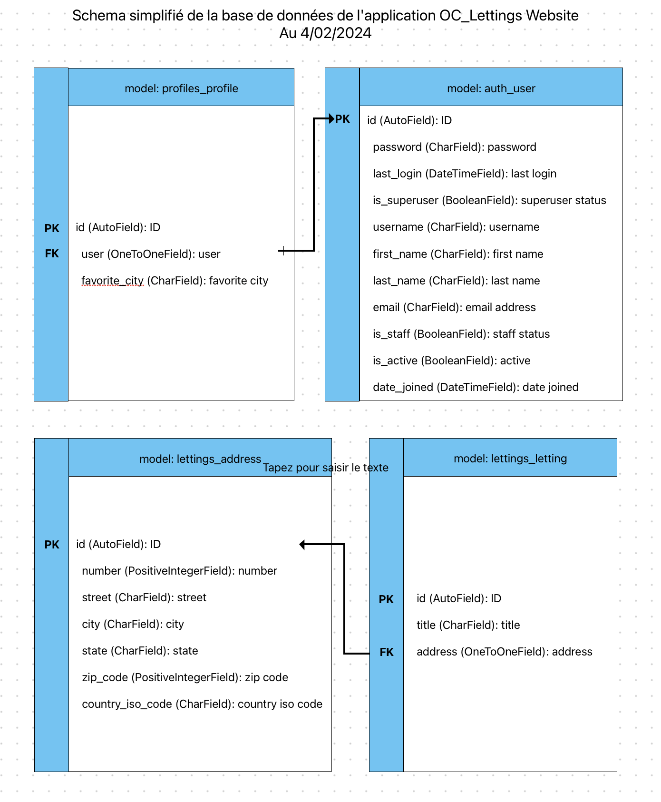

===============================================
Documentation d'Orange County Lettings Website
===============================================
.. image:: https://readthedocs.org/projects/p13-oclettings-v2/badge/?version=latest
   :target: https://p13-oclettings-v2.readthedocs.io/en/latest/?badge=latest
   :alt: Documentation Status

Bienvenue dans la documentation de OC Lettings website

Orange County Lettings est une start-up dans le secteur de la location de biens immobiliers.

L'objectif de cette documentation est de présenter le site web de la start-up et de décrire les fonctionnalités de ce dernier.
Tout en donnant les clés pour une meilleur compréhension des différentes fonctionnalités du site et des choix de développement.

.. Table of Contents
.. _sommaire:

Sommaire
========

.. contents:: :local:
   :depth: 2

Installation du projet en local
-------------------------------

- Clonez ce dépôt de code à l’aide de la commande (vous pouvez également télécharger le code en tant qu’archive zip) :
   .. code-block::

       $ git clone https://github.com/EdwinLRT/P13-OCLettings-V2

- Rendez vous depuis un terminal à la racine du répertoire oc-cg-p13 avec la commande :
   .. code-block::

       $ cd P13-OCLettings

- Créez un environnement virtuel pour le projet avec :

  - sous Windows :

    .. code-block::

        $ python -m venv env

  - sous OsX ou Linux :

    .. code-block::

        $ python3 -m venv env

- Activez l’environnement virtuel avec :
   - sous Windows
      .. code-block::

          $ env\Scripts\activate
   - sous MacOS ou Linux
      .. code-block::

          $ source env/bin/activate

- Installez les dépendances du projet avec :
   .. code-block::

       $ pip install -r requirements.txt

Création des variables d'environnement
--------------------------------------

Créer des variables d'environnement est essentiel pour sécuriser et personnaliser la configuration d'un projet Django.
Cela permet de protéger les données sensibles, de rendre le code portable et de simplifier les mises à jour.
Les variables d'environnement peuvent être stockées dans un fichier .env et chargées dans le code à l'aide de bibliothèques comme python-decouple.
Cela garantit que les informations sensibles ne sont pas exposées dans le code source et facilite la gestion des environnements de développement.

Ce projet nécéssite la création d'un fichier .env à la racine du projet. Et à minima, les variables suivantes doivent être définies :
    - Django Secret Key
    - Django Debug
    - Sentry DSN

Démarrez le serveur local
-------------------------

Après avoir réalisé les étapes d’installation, démarrez le serveur avec :
   .. code-block::

       $ python manage.py runserver

Dans votre navigateur web, rendez vous à l’adresse suivante : http://localhost:8000/

Vous devriez être en mesure d'accéder et de naviguer sur le site de manière locale.
Vous retrouverez les fonctionnalités du site web de la start-up Orange County Lettings,
les profils des utilisateurs et les différentes locations.

Naviguer sur le site
--------------------

Les différents URLs du site sont les suivants :

 - / : Page d’accueil du site.

 - lettings/ : Liste des locations.

 - lettings/<letting_id>/ : Page détaillée d’une location.

 - profiles/ : Liste des profils utilisateurs.

 - profiles/<username>/ : Page détaillée d’un profil utilisateur.

 - admin/ : Interface de gestion administrateur du site.

L'accès à l'interface d'administration est réservé aux utilisateurs ayant les droits d'administration. Pour accéder à cette interface, vous devez créer un superutilisateur avec la commande suivante :

   .. code-block::

       $ python manage.py createsuperuser

Le code source est divisé en trois applications distinctes, permettant de séparer les fonctionnalités du site web:

 - oc_lettings_site : Dossier de configuration principal il centralise les URLs.

 - profiles : Dossier du modèle Profile. Cette application gère les profils utilisateurs.

 - lettings : Dossier du modèle Letting. Cette application gère les locations.

Technologies utilisées
----------------------

 - **Python 3.11**

 - **Django**: C'est un framework web haut niveau en Python qui encourage le développement rapide et une conception propre et pragmatique. Django est utilisé comme le principal framework web pour la construction de votre application.

 - **gunicorn**: Il s'agit d'un serveur HTTP WSGI pour UNIX. gunicorn est un serveur très performant et léger qui s'intègre bien avec les applications Django, permettant de gérer les requêtes HTTP.

 - **pytest** et **pytest-django**: Ce sont des frameworks de test pour Python. pytest fournit un ensemble riche de fonctionnalités pour écrire des tests, tandis que pytest-django est spécifiquement conçu pour tester les applications Django.

 - **coverage** et **pytest-cov**: Ces outils sont utilisés pour mesurer la couverture de code de vos tests. Ils aident à identifier les parties du code qui ne sont pas couvertes par vos tests.

 - **flake8**: Cet outil est utilisés pour l'analyse statique du code. Il aide à maintenir la qualité du code en vérifiant la conformité avec les conventions de codage et en détectant les erreurs potentielles.

 - **Sentry-sdk**: Sentry est un outil de suivi des erreurs qui aide les développeurs à surveiller et à corriger les crashs en temps réel. L'intégration de Sentry dans votre projet Django peut aider à identifier et résoudre rapidement les problèmes.

 - **whitenoise**: WhiteNoise permet à votre application web de servir ses propres fichiers statiques, rendant votre application plus autonome et réduisant la dépendance à des services externes pour la distribution de contenu statique.

 - **python-dotenv**: Utilisé pour gérer les variables d'environnement. Il permet de charger les variables d'environnement à partir d'un fichier .env, ce qui est utile pour configurer des paramètres qui ne doivent pas être codés en dur dans l'application.

 - **Circle CI**: CircleCI est un service d'intégration et de déploiement continu qui automatise le processus de test et de déploiement de votre code. Il offre une configuration facile, une intégration avec divers outils et services, et prend en charge de nombreux langages de programmation et frameworks.

 - **Render**: Render est une plateforme cloud qui permet le déploiement, la gestion et le dimensionnement d'applications. Elle est connue pour sa facilité d'utilisation et sa capacité à simplifier les processus de déploiement d'applications web.

 - **SQlite3**: SQLite3 est un système de gestion de base de données relationnelle léger, qui est intégré dans l'application. Il est très apprécié pour sa simplicité, sa fiabilité et son indépendance, ne nécessitant pas de serveur de base de données séparé.

Pipeline de CI/CD en détails
----------------------------

Le fichier CircleCI (config.yml) est un fichier de configuration pour les pipelines de CI/CD (Continuous Integration/Continuous Delivery) qui définit trois jobs distincts au sein de la plateforme CircleCI. Voici le détail des étapes et de leurs objectifs :

**Job: build-and-test**

Objectif général: Construire l'environnement et exécuter des tests sur le code.
Étapes:
checkout: Récupère le code source du dépôt git pour le build.
restore_cache: Tente de restaurer un cache sauvegardé des dépendances basé sur une clé qui inclut le checksum du fichier requirements.txt. Ceci est utilisé pour accélérer l'installation des dépendances en évitant des téléchargements répétés.
python/install-packages: Utilise l'orb Python de CircleCI pour installer des paquets avec pip, le gestionnaire de paquets Python.
Linting: Installe flake8 et l'exécute pour vérifier que le code source suit les conventions de style.
Run Tests and Check Coverage: Installe pytest et pytest-cov, puis exécute les tests unitaires et vérifie la couverture du code. Les tests doivent couvrir au moins 80% du code, sinon le build échoue.
save_cache: Sauvegarde le cache des dépendances si l'étape d'installation a réussi pour les utilisations futures.

**Job: build-docker-image**

Objectif général: Construire une image Docker du projet pour le déploiement.
Étapes:
checkout: Récupère le code source du dépôt git pour le build.
setup_remote_docker: Configure l'environnement Docker distant pour permettre la construction d'images Docker.
Build Docker Image: Construit une image Docker du projet, en utilisant une variable d'environnement pour la clé secrète Django.
Docker Login: Se connecte au Docker Hub en utilisant les identifiants fournis par les variables d'environnement.
Docker Push: Tag et pousse l'image construite vers le Docker Hub pour le déploiement.

**Job: deploy-to-render**

Objectif général: Déployer l'application sur le service Render.
Étapes:
Utilise curl pour envoyer une requête POST à l'API de Render, en utilisant une clé API pour s'authentifier et forcer le déploiement du service spécifié par RENDER_SERVICE_ID.

**Workflows:**
Définit le flux de travail build-and-deploy.
Spécifie l'ordre dans lequel les jobs doivent être exécutés :
build-and-test doit s'exécuter en premier.
build-docker-image doit attendre que build-and-test soit terminé.
deploy-to-render doit attendre que build-docker-image soit terminé.
Chaque job est conçu pour être une étape dans le processus de livraison du code de la source à la production, avec la construction et les tests d'abord, la création de l'image Docker ensuite, et enfin le déploiement de l'application.

Utiliser la pipeline de CI/CD pour déployer l'application
---------------------------------------------------------

Pour déployer votre application en utilisant le fichier de configuration CircleCI fourni, suivez ces étapes générales. Le déploiement se déclenchera automatiquement suite à un commit sur la branche **main** du dépôt Git :

Prérequis :

Assurez-vous que votre projet est configuré sur CircleCI et que le dépôt Git est lié à votre compte CircleCI.
Configurez les variables d'environnement nécessaires dans CircleCI, telles que DJANGO_SECRET_KEY, DOCKERHUB_USERNAME, DOCKERHUB_PASSWORD, et RENDER_API_KEY, pour que le processus de CI/CD puisse les utiliser.

**Commit et Push sur la branche main :**

Faites des modifications dans votre code et commitez-les sur votre branche locale.
Poussez ces modifications (push) sur la branche main de votre dépôt Git. Ceci déclenchera le pipeline CI/CD dans CircleCI.

Après le déploiement, vérifiez le statut du déploiement dans l'interface utilisateur de CircleCI pour vous assurer que tous les jobs ont réussi sans erreur.
Vérifiez également que l'application fonctionne comme prévu sur Render en accédant à l'URL du service.
En suivant ces étapes, chaque fois que vous committez sur la branche main, le pipeline CI/CD configuré dans votre fichier CircleCI sera automatiquement déclenché, menant au déploiement de votre application sur Render, en s'assurant que seules les versions testées et vérifiées sont déployées.

Base de donnée du projet et diagramme de l'architecture
-------------------------------------------------------

Les informations du site sont conservées dans un fichier SQLite appelé website.sqlite3.
Cette approche est provisoire, en vue d'une augmentation future de l'usage du site qui nécessiterait le passage à une technologie plus appropriée, capable de gérer un volume de données plus important et de supporter des opérations plus complexes.

Le diagramme simplifié de la base de données est le suivant :

Exemples d'utilisation
----------------------

Accès au site
~~~~~~~~~~~~~
Pour accéder au site après un déploiement réussi, veuillez entrer l’adresse suivante dans votre navigateur:

   .. code-block::

        http://<ip-publique>:8000/

Accès aux profils utilisateurs (profiles)
~~~~~~~~~~~~~~~~~~~~~~~~~~~~~~~~~~~~~~~~~
Une fois sur le site, veuillez cliquer sur le bouton Profiles. Cela vous mènera à la liste des profils utilisateurs inscrits sur le site. Veuillez cliquer sur l’un des profils pour accéder à sa page détaillée. Les URLs correspondants sont les suivantes :

   .. code-block::

        http://<ip-publique>:8000/profiles/

        http://<ip-publique>:8000/profiles/<nom_d'utilisateur>/

Accès aux locations (lettings)
~~~~~~~~~~~~~~~~~~~~~~~~~~~~~~
Veuillez cliquer sur le bouton “Lettings”. Cela vous mènera à la liste des locations enregistrées dans la base de données.
Vous pouvez cliquer sur une location pour accéder à sa page détaillée.

Les URLs correspondants sont les suivantes:

   .. code-block::

        http://<ip-publique>:8000/lettings/

        http://<ip-publique>:8000/lettings/<id_de_la_location>/
